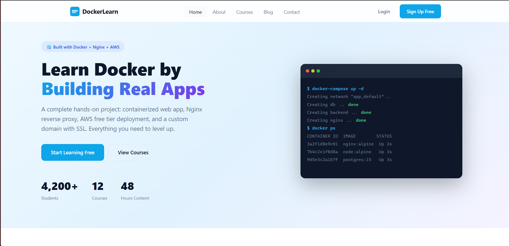
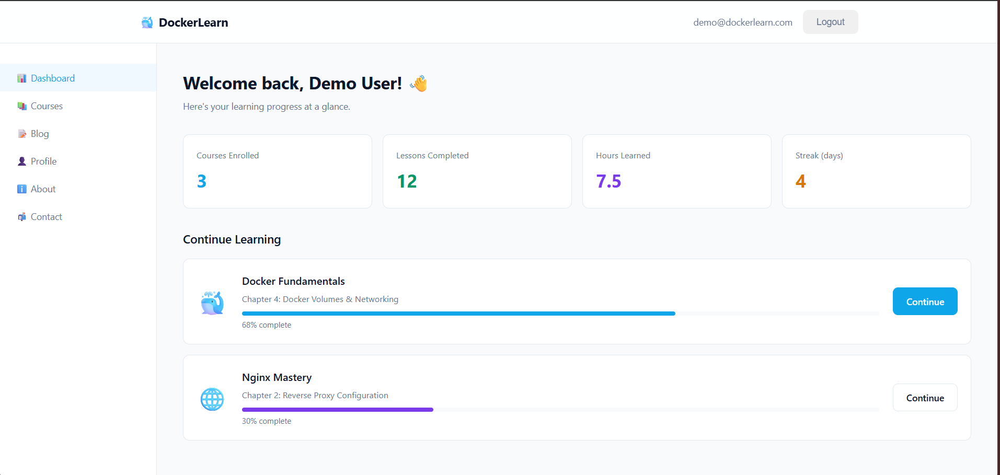
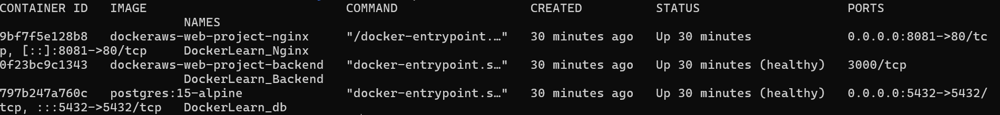
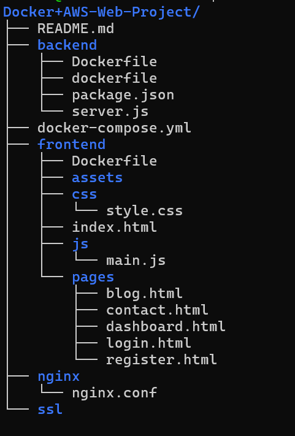

# 🐳 Docker + AWS — DockerLearn Project

> A fully working website deployed with Docker containers, Nginx reverse proxy, and AWS. Built for learning real DevOps skills through a real project.

---

## 🖥️ Live Project Screenshots

### Website — Running in Docker


### Dashboard — After Login (JWT Auth + PostgreSQL)


### Containers Running (`docker ps`)


---

## 📁 Project Structure



```


---

## 🐳 Docker Architecture


### How the 3 Containers Work Together

| Container | Image | Port | Role |
|-----------|-------|------|------|
| `DockerLearn_Nginx` | `nginx:alpine` | `80` / `443` | Web server + Reverse proxy |
| `DockerLearn_Backend` | `node:20-alpine` | `3000` (internal) | REST API + Auth |
| `DockerLearn_db` | `postgres:15-alpine` | `5432` (internal) | Database |

> **Key insight:** Only Nginx exposes ports to the internet. The backend and database are **only reachable inside the Docker network** — they are never directly exposed.

---

## 🧠 Docker Concepts in This Project


### 1. 📦 Images

An image is the **blueprint** — a read-only template. We use three official images:

```bash
# Pull images manually (docker-compose does this automatically)
docker pull nginx:alpine
docker pull node:20-alpine
docker pull postgres:15-alpine

# List all images on your machine
docker images

# See what layers make up an image
docker history nginx:alpine
```

> **Why alpine?** Alpine Linux is a minimal ~5MB base. `nginx:alpine` is ~25MB vs `nginx` at ~140MB. Smaller = faster to build, pull, and fewer security vulnerabilities.

---

### 2. 🐳 Containers

A container is a **running instance** of an image — isolated, lightweight, and disposable.

```bash
# See running containers
docker ps

# See all containers (including stopped ones)
docker ps -a

# Stop a specific container
docker stop DockerLearn_Nginx

# Start it again
docker start DockerLearn_Nginx

# Remove a stopped container
docker rm DockerLearn_Nginx

# Enter a running container's shell
docker exec -it DockerLearn_Backend sh

# Enter the PostgreSQL shell
docker exec -it DockerLearn_db psql -U postgres -d dockerlearn
```

---

### 3. 📝 Dockerfile

Each service has its own `Dockerfile` — the build instructions for its image.

**Backend Dockerfile** (`backend/Dockerfile`):

```dockerfile
FROM node:20-alpine          # Start from Node.js alpine image

WORKDIR /app                 # All commands run from /app inside container

# Copy package.json FIRST — enables Docker layer caching
# npm install only re-runs when package.json changes, not on every code change
COPY package*.json ./
RUN npm install --omit=dev

COPY . .                     # Copy source code

EXPOSE 3000                  # Document which port this container uses

# Health check — Docker monitors this to know if container is healthy
HEALTHCHECK --interval=30s --timeout=10s --retries=3 \
  CMD wget -qO- http://localhost:3000/api/health || exit 1

CMD ["node", "server.js"]   # Start command
```

**Why copy `package.json` before source code?**

Docker builds images layer by layer. Each instruction is cached. If you copy everything at once, any code change invalidates the cache and forces `npm install` to run again (slow!). By copying `package.json` first, the `npm install` layer is only invalidated when **dependencies** change.

---

### 4. 🔀 Docker Compose

`docker-compose.yml` defines and orchestrates all services in one file.

```bash
# Start all containers in background
docker-compose up -d

# Start and rebuild images (after Dockerfile or code changes)
docker-compose up -d --build

# View live logs for all services
docker-compose logs -f

# View logs for one service only
docker-compose logs -f backend

# Stop all containers (keeps volumes/data)
docker-compose down

# Stop AND delete all data (volumes)
docker-compose down -v

# Check health status of all services
docker-compose ps

# Restart a single service
docker-compose restart nginx

# Scale a service (run 3 backend instances)
docker-compose up -d --scale backend=3
```

**Key `docker-compose.yml` concepts:**

```yaml
services:
  backend:
    build: ./backend           # Build from local Dockerfile
    depends_on:
      db:
        condition: service_healthy   # Wait for DB health check to pass
    environment:
      DB_HOST: db              # "db" = Docker service name = internal DNS!
    # No ports: exposed — only Nginx can reach it
```

---

### 5. 💾 Volumes — Persistent Storage

Without volumes, **all data is lost** when a container is removed. Volumes persist data on the host machine.

```bash
# List all Docker volumes
docker volume ls

# Inspect a volume (see where data is on host)
docker volume inspect dockerlearn_db_data

# The database data survives container restarts:
docker-compose down           # Remove containers
docker-compose up -d          # Data is still there!

# Only this deletes data permanently:
docker-compose down -v        # ⚠️ Deletes all volumes
```

In `docker-compose.yml`:
```yaml
services:
  db:
    volumes:
      - db_data:/var/lib/postgresql/data  # Named volume → persistent

volumes:
  db_data:                                # Declare the named volume
    name: dockerlearn_db_data
```

---

### 6. 🔗 Networks — Container Communication

All containers join a custom bridge network. Docker provides **built-in DNS** — containers reach each other by **service name**, not IP address.

```bash
# List Docker networks
docker network ls

# Inspect our network (see connected containers)
docker network inspect dockerlearn_network
```

```
# From nginx container → reaches backend:
proxy_pass http://backend:3000;   ← "backend" resolves to container IP

# From backend container → reaches database:
DB_HOST: db                        ← "db" resolves to postgres container IP
```

> **Why custom network?** The default Docker bridge network doesn't support DNS by service name. Custom networks do. Always define one in `docker-compose.yml`.

---

### 7. ❤️ Health Checks

Docker health checks monitor whether a container is truly ready — not just running.

```yaml
# In docker-compose.yml
db:
  healthcheck:
    test: ["CMD-SHELL", "pg_isready -U postgres -d dockerlearn"]
    interval: 10s     # Check every 10 seconds
    timeout: 5s       # Fail if no response in 5s
    retries: 5        # Mark unhealthy after 5 failures

backend:
  depends_on:
    db:
      condition: service_healthy   # Don't start until DB passes healthcheck
```

```bash
# Check health status
docker ps                          # Shows (healthy) or (unhealthy)
docker inspect DockerLearn_Backend | grep -A5 Health
```

---

### 8. 🌐 Nginx as Reverse Proxy

Nginx sits in front of everything. Clients only talk to Nginx — never directly to Node.js or PostgreSQL.

```nginx
# nginx/nginx.conf

upstream backend_api {
  server backend:3000;    # Docker service name
}

server {
  listen 80;

  # Static files — served directly by Nginx (fast!)
  location / {
    root /usr/share/nginx/html;
    try_files $uri $uri/ $uri.html =404;
  }

  # API requests — proxied to Node.js
  location /api/ {
    proxy_pass http://backend_api;
    proxy_set_header X-Real-IP $remote_addr;
    proxy_set_header Host $host;
  }

  # Static assets cached for 30 days
  location ~* \.(css|js|png|jpg|svg)$ {
    expires 30d;
    add_header Cache-Control "public, immutable";
  }
}
```

**Why a reverse proxy?**
- Single domain for frontend + API (no CORS issues)
- Backend stays hidden from the internet
- Nginx handles SSL — backend stays plain HTTP
- Gzip compression, caching, security headers — all in one place

---

## ☁️ AWS  Deployment


### AWS Resources Used

| Resource |  | Used |
|----------|-----------|------|
| EC2 t2.micro | 750 hrs/month | 1 instance (always on) ✅ |
| EBS Storage | 30 GB | ~8 GB ✅ |
| Data Transfer Out | 15 GB/month | Well within limit ✅ |
| S3 (optional) | 5 GB | File uploads ✅ |
| Route 53 | Not free | Use free domain instead ✅ |

> ⚠️ **Tip:** Set a $1 billing alert in AWS Console → Billing → Budgets → Create Budget so you're never surprised.

---

### Step 1 — Launch EC2 Instance

1. **AWS Console** → EC2 → **Launch Instance**
2. **AMI:** Ubuntu 22.04 LTS
3. **Instance type:** `t2.micro` (1 vCPU, 1 GB RAM — )
4. **Storage:** 20 GB `gp3`
5. **Key pair:** Create new → download `.pem` file
6. **Security Group** — allow these inbound rules:

| Type | Port | Source |
|------|------|--------|
| SSH | 22 | My IP (your IP only) |
| HTTP | 80 | 0.0.0.0/0 (everyone) |
| HTTPS | 443 | 0.0.0.0/0 (everyone) |

---

### Step 2 — Connect to EC2

```bash
# Fix key file permissions (required on Linux/Mac)
chmod 400 your-key.pem

# SSH into your instance
ssh -i your-key.pem ubuntu@YOUR_EC2_PUBLIC_IP
```

---

### Step 3 — Install Docker on EC2

```bash
# Update system packages
sudo apt update && sudo apt upgrade -y

# Install Docker (official script)
curl -fsSL https://get.docker.com -o get-docker.sh
sudo sh get-docker.sh

# Allow ubuntu user to run docker without sudo
sudo usermod -aG docker ubuntu
newgrp docker

# Install Docker Compose
sudo curl -L \
  "https://github.com/docker/compose/releases/latest/download/docker-compose-$(uname -s)-$(uname -m)" \
  -o /usr/local/bin/docker-compose
sudo chmod +x /usr/local/bin/docker-compose

# Verify installation
docker --version
docker-compose --version
```

---

### Step 4 — Upload Project and Start

```bash
# Upload from your local machine
scp -i your-key.pem -r Docker+AWS-Web-Project ubuntu@YOUR_EC2_IP:~/

# OR clone from GitHub
git clone https://github.com/yourusername/Docker-AWS-Web-Project.git
cd Docker-AWS-Web-Project

# Start all containers
docker-compose up -d --build

# Verify all containers are healthy
docker-compose ps
docker-compose logs -f
```

Your site is now live at: **`http://YOUR_EC2_PUBLIC_IP`**

---

### Step 5 — Get a Free Domain

**Option A — DuckDNS** (recommended, developer-friendly)
1. Go to [duckdns.org](https://www.duckdns.org) → log in with Google/GitHub
2. Create a subdomain: `yourapp.duckdns.org`
3. Set the IP to your EC2 Public IP
4. Done — no DNS propagation wait needed

**Option B — Freenom** (free `.tk` / `.ml` domains)
1. Go to [freenom.com](https://www.freenom.com)
2. Search and register a free domain (1 year)
3. Set DNS A record → EC2 IP

```
Type: A     Name: @      Value: YOUR_EC2_PUBLIC_IP    TTL: 300
Type: A     Name: www    Value: YOUR_EC2_PUBLIC_IP    TTL: 300
```

---

### Step 6 — Free SSL with Let's Encrypt

```bash
# On EC2 — install Certbot
sudo apt install certbot python3-certbot-nginx -y

# Stop Nginx container temporarily (Certbot needs port 80)
docker-compose stop nginx

# Get free SSL certificate (runs its own temp server)
sudo certbot certonly --standalone \
  -d yourapp.duckdns.org \
  --email your@email.com \
  --agree-tos --no-eff-email

# Certificates saved to:
# /etc/letsencrypt/live/yourapp.duckdns.org/fullchain.pem
# /etc/letsencrypt/live/yourapp.duckdns.org/privkey.pem
```

**Update `docker-compose.yml`** — add cert volume and port 443:

```yaml
nginx:
  ports:
    - "80:80"
    - "443:443"                          # Add this
  volumes:
    - ./nginx/nginx.conf:/etc/nginx/nginx.conf:ro
    - /etc/letsencrypt:/etc/letsencrypt:ro    # Add this
```

**Update `nginx/nginx.conf`** — enable HTTPS server block:

```nginx
server {
  listen 443 ssl http2;
  server_name yourapp.duckdns.org;

  ssl_certificate     /etc/letsencrypt/live/yourapp.duckdns.org/fullchain.pem;
  ssl_certificate_key /etc/letsencrypt/live/yourapp.duckdns.org/privkey.pem;
  ssl_protocols TLSv1.2 TLSv1.3;

  # ... same location blocks as port 80 ...
}

# Redirect all HTTP to HTTPS
server {
  listen 80;
  server_name yourapp.duckdns.org;
  return 301 https://$host$request_uri;
}
```

```bash
# Restart Nginx with HTTPS
docker-compose up -d --build nginx
```

Visit **`https://yourapp.duckdns.org`** 🎉

**Auto-renew SSL** (certificates expire every 90 days):

```bash
sudo crontab -e

# Add this line — checks renewal twice daily
0 0,12 * * * certbot renew \
  --pre-hook "docker stop DockerLearn_Nginx" \
  --post-hook "docker start DockerLearn_Nginx" \
  --quiet
```

---

## 🔧 Essential Docker Commands Reference

```bash
# ── Container Management ──────────────────────────────────────
docker ps                          # Running containers
docker ps -a                       # All containers
docker start CONTAINER             # Start stopped container
docker stop CONTAINER              # Gracefully stop
docker restart CONTAINER           # Restart
docker rm CONTAINER                # Delete (must be stopped)
docker logs CONTAINER              # View logs
docker logs -f CONTAINER           # Follow logs live
docker stats                       # Live CPU/memory per container
docker inspect CONTAINER           # Full JSON details

# ── Image Management ──────────────────────────────────────────
docker images                      # List images
docker pull nginx:alpine           # Download image
docker build -t myapp ./backend    # Build from Dockerfile
docker rmi IMAGE                   # Delete image
docker image prune                 # Delete unused images

# ── Inside Containers ─────────────────────────────────────────
docker exec -it CONTAINER sh       # Open shell (alpine)
docker exec -it CONTAINER bash     # Open bash (ubuntu/debian)
docker cp file.txt CONTAINER:/app/ # Copy file into container
docker cp CONTAINER:/app/log.txt . # Copy file out

# ── Volumes ───────────────────────────────────────────────────
docker volume ls                   # List volumes
docker volume inspect VOLUME       # Details + mount path
docker volume rm VOLUME            # Delete volume
docker volume prune                # Delete unused volumes

# ── Networks ──────────────────────────────────────────────────
docker network ls                  # List networks
docker network inspect NETWORK     # Details
docker network create mynet        # Create network

# ── Cleanup ───────────────────────────────────────────────────
docker system prune                # Remove unused containers, images
docker system prune -a             # Remove everything unused
docker system df                   # Disk usage

# ── Compose ───────────────────────────────────────────────────
docker-compose up -d               # Start all services
docker-compose up -d --build       # Rebuild + start
docker-compose down                # Stop + remove containers
docker-compose down -v             # Also delete volumes ⚠️
docker-compose logs -f             # Follow all logs
docker-compose logs -f backend     # One service only
docker-compose ps                  # Status + health
docker-compose exec db psql -U postgres  # Run command in service
docker-compose restart nginx       # Restart one service
docker-compose pull                # Update all images
```

---

## 🔒 Production Security Checklist

```bash
# 1. Change ALL default passwords in docker-compose.yml
openssl rand -base64 32   # Generate strong DB password
openssl rand -base64 64   # Generate strong JWT secret

# 2. Remove DB port from docker-compose.yml (don't expose 5432 publicly)
# Delete this from the db service:
#   ports:
#     - "5432:5432"

# 3. Set up UFW firewall on EC2
sudo ufw allow 22
sudo ufw allow 80
sudo ufw allow 443
sudo ufw enable
sudo ufw status

# 4. Enable automatic security updates
sudo apt install unattended-upgrades -y
sudo dpkg-reconfigure --priority=low unattended-upgrades

# 5. Keep Docker images updated monthly
docker-compose pull
docker-compose up -d --build
```

---

## 🛠️ Troubleshooting

```bash
# Containers not starting?
docker-compose logs db            # Check DB logs
docker-compose logs backend       # Check backend logs

# Port already in use?
sudo lsof -i :80                  # See what's using port 80
sudo systemctl stop apache2       # Stop Apache if running

# Database connection refused?
docker-compose exec backend ping db     # Can backend reach db?
docker exec -it DockerLearn_db pg_isready -U postgres

# Nginx not proxying?
docker exec DockerLearn_Nginx nginx -t  # Test config syntax
docker exec DockerLearn_Nginx nginx -s reload

# Out of disk space?
docker system prune -a            # Clean unused resources
df -h                             # Check disk usage
```

---

*Built for learning Docker, Nginx, and AWS — hands-on, no toy examples.* 🐳
